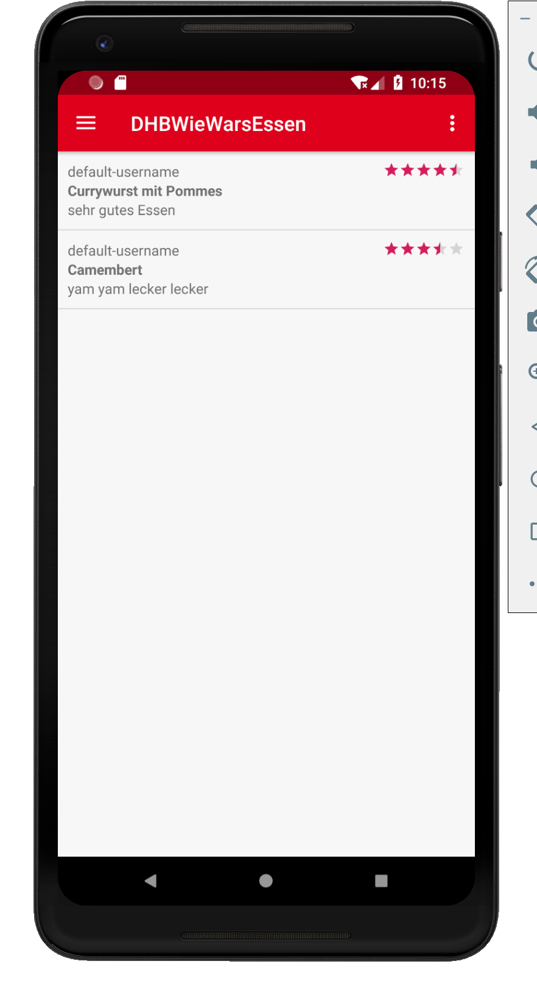
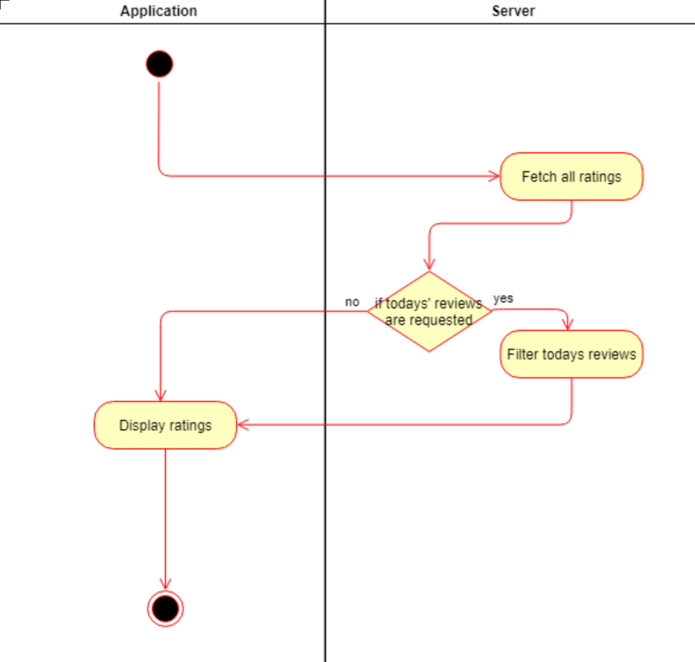

# Use-Case Specification: 

# Table of Contents
- [Analyze Acceleration Behavior](#1-analyze-acceleration-behavior)
    - [Brief Description](#11-brief-description)
    - [Screenshots](#12-screenshots)
- [Flow of Events](#2-flow-of-events)
    - [Basic Flow](#21-basic-flow)
    - [Alternative Flows](#22-alternative-flows)
- [Special Requirements](#3-special-requirements)
- [Preconditions](#4-preconditions)
- [Postconditions](#5-postconditions)

# 1. Analyze Acceleration Behavior
## 1.1 Brief Description

This action is executed whenever ratings are fetched from the database. Depending on which data is needed the list is getting filtered and then displayed on the screen. Maybe it will also be needed when a review is added, deleted or edited.

## 1.2 Mockup

## 1.3 Screenshot

# 2. Flow of Events

## 2.1 Basic Flow

## 2.2 Alternative Flows

n/a

# 3. Special Requirements

n/a

# 4. Preconditions
A page is getting opened in which a list of reviews is needed.

# 5. Postconditions
The page displays the requested list of reviews.

# 6. Function Points

tbd