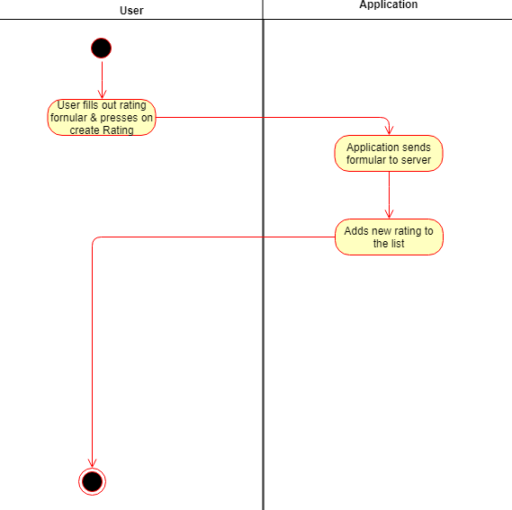
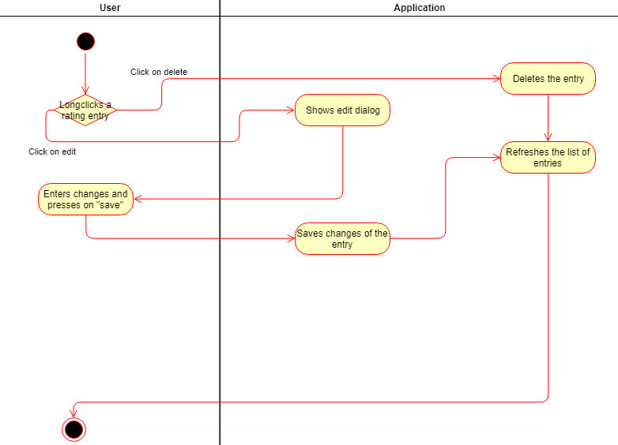

# Use-Case Specification: Manage Rating

# Table of Contents
- [Analyze Acceleration Behavior](#1-analyze-acceleration-behavior)
    - [Brief Description](#11-brief-description)
    - [Screenshots](#12-screenshots)
- [Flow of Events](#2-flow-of-events)
    - [Basic Flow](#21-basic-flow)
    - [Alternative Flows](#22-alternative-flows)
- [Special Requirements](#3-special-requirements)
- [Preconditions](#4-preconditions)
- [Postconditions](#5-postconditions)

# 1. Analyze Acceleration Behavior

## 1.1 Brief Description

Create, edit & delete ratings of the logged in user.

## 1.2 Screenshots

# 2. Flow of Events
## 2.1 Basic Flow
Create:

Edit & Delete:

## 2.2 Alternative Flows

n/a

# 3. Special Requirements

You have to be to logged in to be able to use the features

# 4. Preconditions

* Create:
	* User has to be logged in.
* Edit:
	* The logged in user needs to have a rating which they created ealier.
* Delete:
	* The logged in user needs to have a rating which they created earlier.

# 5. Postconditions
n/a

# 6. Function Points
n/a
