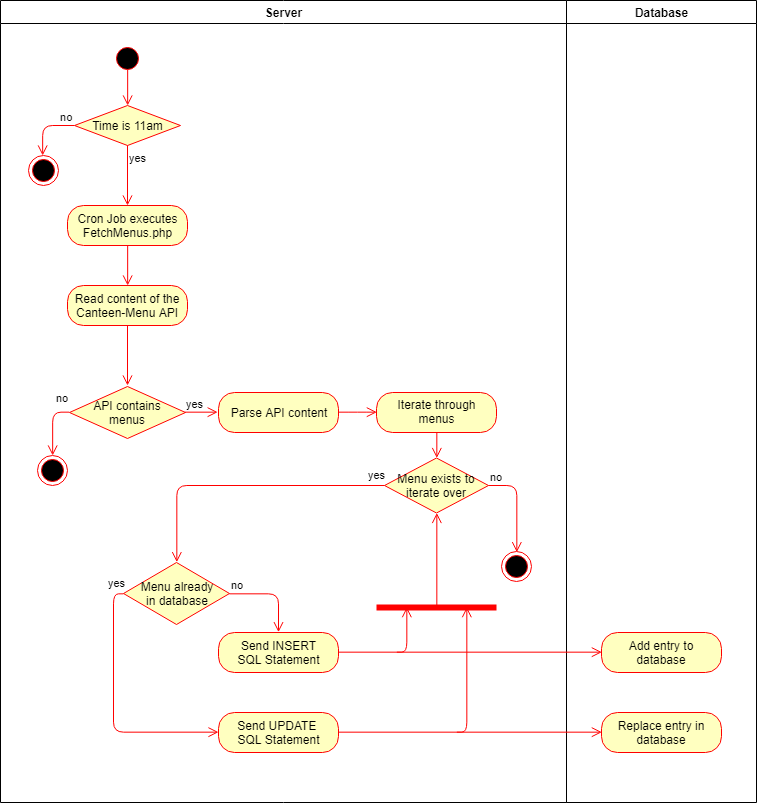

# Use-Case Specification: Receive Menus

# Table of Contents
- [Analyze Acceleration Behavior](#1-analyze-acceleration-behavior)
    - [Brief Description](#11-brief-description)
    - [Screenshots](#12-screenshots)
- [Flow of Events](#2-flow-of-events)
    - [Basic Flow](#21-basic-flow)
    - [Alternative Flows](#22-alternative-flows)
- [Special Requirements](#3-special-requirements)
- [Preconditions](#4-preconditions)
- [Postconditions](#5-postconditions)

# 1. Analyze Acceleration Behavior
## 1.1 Brief Description

The process of reading and parsing the DHBW-Canteen API and writing the menus to the database. If a menu for a certain date already has an entry in the database it is replaced or rather updated, otherwise the menu is added as a new entry. 

## 1.2 Screenshots

n/a

# 2. Flow of Events
## 2.1 Basic Flow

## 2.2 Alternative Flows

n/a

# 3. Special Requirements

n/a

# 4. Preconditions

The API of the DHBW Canteen should contain data.

The Server running the database has to be reachable in order for the script to establish an SQL connection.

The script is executed via a Cron Job which runs the PHP script at 11am every day. That way the menu for the current day, which has already been written to the database the previous day, can be updated in case the canteen changes plans.

# 5. Postconditions

The menus of the next five days are added to the database. Entrys that already exist for a specific day are updated.

# 6. Function Points

n/a