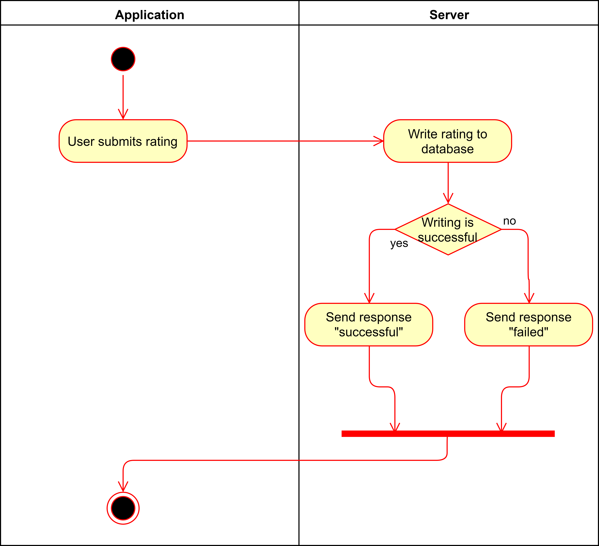

# Use-Case Specification: 

# Table of Contents
- [Analyze Acceleration Behavior](#1-analyze-acceleration-behavior)
    - [Brief Description](#11-brief-description)
    - [Screenshots](#12-screenshots)
- [Flow of Events](#2-flow-of-events)
    - [Basic Flow](#21-basic-flow)
    - [Alternative Flows](#22-alternative-flows)
- [Special Requirements](#3-special-requirements)
- [Preconditions](#4-preconditions)
- [Postconditions](#5-postconditions)

# 1. Analyze Acceleration Behavior
## 1.1 Brief Description

Receive a rating that was sent to the server by the application and add the rating to the database.

## 1.2 Screenshots

# 2. Flow of Events
## 2.1 Basic Flow

## 2.2 Alternative Flows

# 3. Special Requirements

The user has to be logged in in order to submit a rating that can be received by the server.

# 4. Preconditions

* Rating has to have the correct format.
* Rating cannot be empty.

# 5. Postconditions

The received rating will be saved to the databank accordingly.

# 6. Function Points

n/a