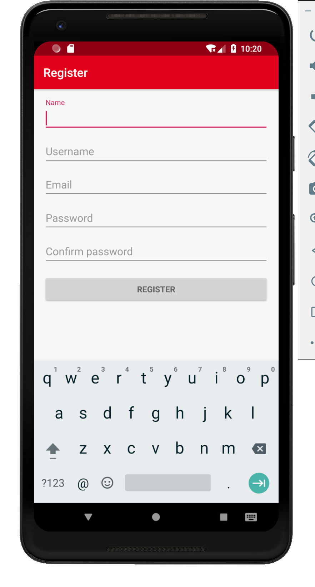

# Use-Case Specification: Register

# Table of Contents
- [Analyze Acceleration Behavior](#1-analyze-acceleration-behavior)
    - [Brief Description](#11-brief-description)
    - [Screenshots](#12-screenshots)
- [Flow of Events](#2-flow-of-events)
    - [Basic Flow](#21-basic-flow)
    - [Alternative Flows](#22-alternative-flows)
- [Special Requirements](#3-special-requirements)
- [Preconditions](#4-preconditions)
- [Postconditions](#5-postconditions)

# 1. Analyze Acceleration Behavior
## 1.1 Brief Description

The process of registration of a new user.

## 1.2 Screenshots

# 2. Flow of Events
## 2.1 Basic Flow

## 2.2 Alternative Flows
# 3. Special Requirements

n/a

# 4. Preconditions

n/a

# 5. Postconditions

The new registered user is created on server and logged in in the application.
The Register Activity should close and the previous page should be shown.

# 6. Function Points

n/a