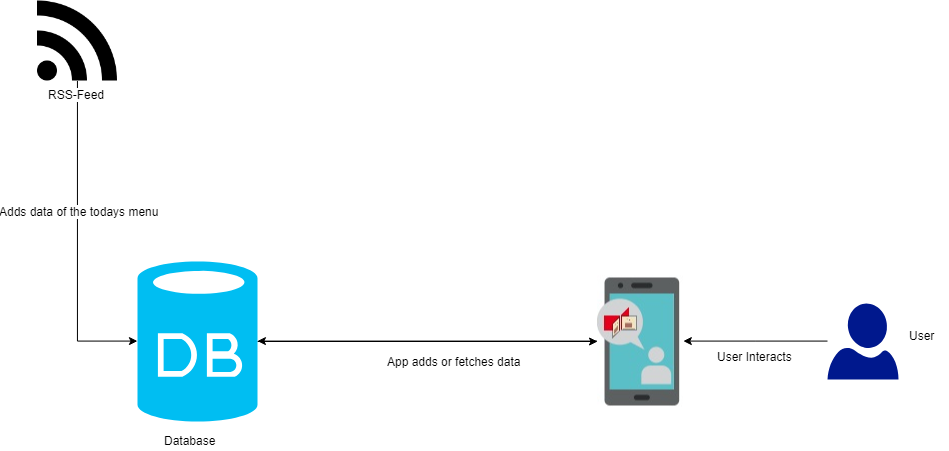
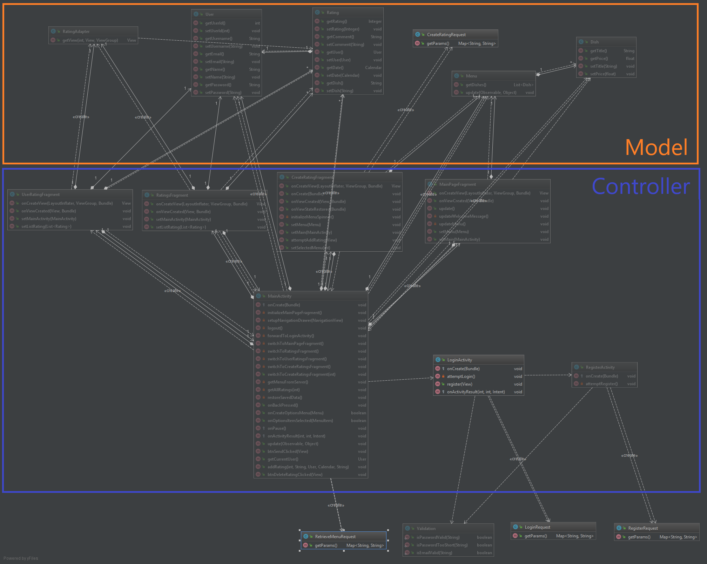

# Software Architecture Document

# Table of Contents
- [Introduction](#1-introduction)
    - [Purpose](#11-purpose)
    - [Scope](#12-scope)
    - [Definitions, Acronyms and Abbreviations](#13-definitions-acronyms-and-abbreviations)
    - [References](#14-references)
    - [Overview](#15-overview)
- [Architectural Representation](#2-architectural-representation)
- [Architectural Goals and Constraints](#3-architectural-goals-and-constraints)
- [Use-Case View](#4-use-case-view)
    - [Use-Case Realizations](#41-use-case-realizations)
- [Logical View](#5-logical-view)
- [Process View](#6-process-view)
- [Deployment View](#7-deployment-view)
- [Implementation View](#8-implementation-view)
    - [Overview](#81-overview)
    - [Layers](#82-layers)
- [Data View](#9-data-view)
- [Size and Performance](#10-size-and-performance)
- [Quality](#11-quality)

## 1. Introduction

### 1.1 Purpose

This document provides a comprehensive architectural overview of the system, using a number of different architectural views to depict different aspects of the system. It is intended to capture and convey the significant architectural decisions which have been made on the system.

### 1.2 Scope

The scope of this SAS is to show the architecture of our DHBWieWarsEssen project. Illustrated are the Use-Cases, the class and data structure.

### 1.3 Definitions, Acronyms and Abbreviations

| Abbrevation | Description                            |
| ----------- | -------------------------------------- |
| MVC         | Model View Controller                  |
| SRS         | Software Requirements Specification    |
| UC          | Use Case                               |
| VCS         | Version Control System                 |
| n/a         | not applicable                         |

### 1.4 References

### 1.5 Overview

This document contains the Architectural Representation, Goals and Constraints as well as the Logical, Deployment, Implementation and Data Views from the application "DHBWieWarsEssen".

## 2. Architectural Representation

The application consists of a database and an android app. The database is used by the android app to store data of users, for example when leaving a rating. Also we have a RSS-Feed so we can load in todays menus and make the available to leave a rating on them.

## 3. Architectural Goals and Constraints

Currently we are statisfied with our architecture. (See picture above) The architecture which we want to adapt though is the one in the app itself. We try to achieve a architecture which represents a MVC-Architecture.

## 4. Use-Case View

### 4.1 Use-Case Realizations

N/A

## 5. Logical View

## 6. Process View

N/A

## 7. Deployment View

tbd

## 8. Implementation View

N/A

### 8.1 Overview

N/A

### 8.2 Layers

N/A

## 9. Data View

Our data is stored in an online MySQL-Database which you can reach anywhere as long as you have internet access.

## 10. Size and Performance

The goal is to keep the app to the essentials and have a fast database so people don't get annoyed by the wait times. Also we don't to display unnecessary information to avoid confusion of the user.

## 11. Quality/Metrics

N/A